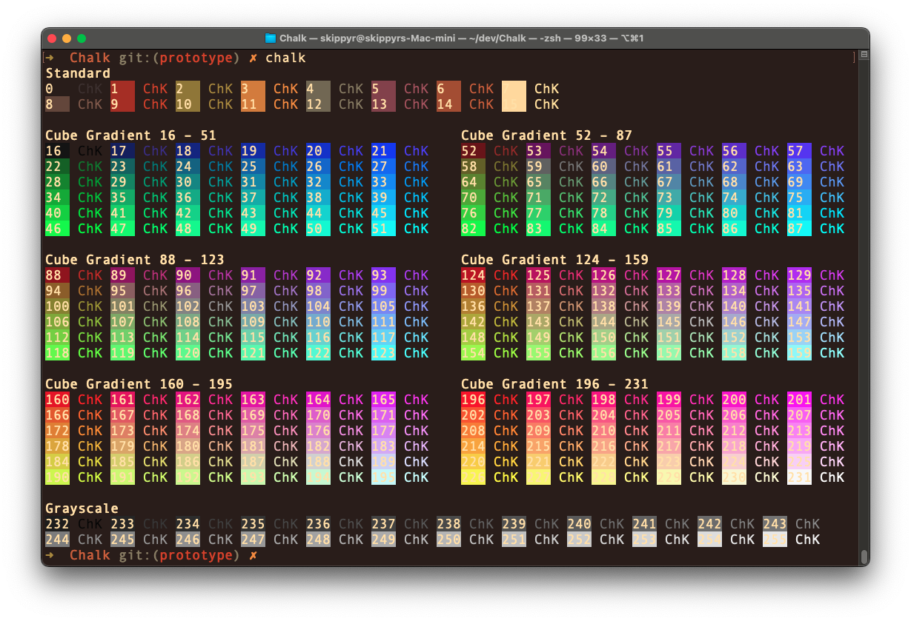

# Chalk
## About
A command line tool that displays the terminal 8-bit colors, useful for debugging. It is available for macOS.



## Install
### Prerequisites
In order to use this software, the following requirements must be fulfilled:
- Have the latest version of the Swift Toolchain installed.

### Procedures
- Use `swift` to compile the software:

```zsh
swift build -c release
```

- Add `.build/release/chalk` to your system `PATH` environment variable.

## Help
If you need help related to this project, open a new issue in its [issues pages](https://gitlab.com/skippyr/Chalk/issues) or send an [e-mail](mailto:skippyr.developer@icloud.com) describing what is going on.

## Contributing
This project is open to review and possibly accept contributions in the form of bug reports and suggestions. If you are interested, send your contribution to its [merge requests](https://gitlab.com/skippyr/Chalk/merge_requests) page or via [e-mail](mailto:skippyr.developer@icloud.com).

## Copyright
This is free software licensed under the BSD 3-Clause License that comes WITH NO WARRANTY. Refer to the `LICENSE` file that comes in its source code for license and copyright details.
