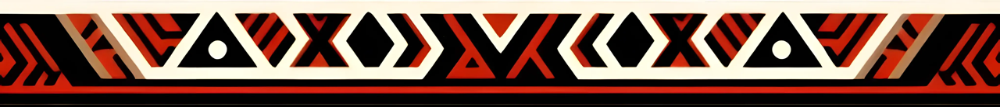
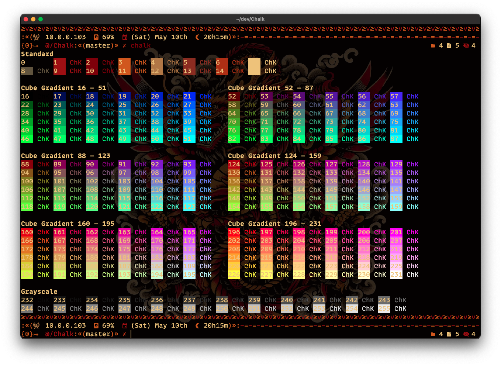

<p align="center">
  
</p>
<h1 align="center">≥v≥v&ensp;Chalk&ensp;≥v≥v</h1>
<p align="center">
  
  &nbsp;
  
  &nbsp;
  
  &nbsp;
  
</p>

## ❡ About
A command line tool that displays the terminal 8-bit ANSI colors, useful for debugging. It is available for macOS.

<p align="center">
  
</p>
<p align="center"><strong>Caption:</strong> a preview of Chalk running in <a href="https://github.com/kovidgoyal/kitty">Kitty</a> on macOS. Shell theme is <a href="https://github.com/skippyr/river_dreams">River Dreams</a> and font is <a href="https://www.monolisa.dev">Monolisa</a> (with fallback to <a href="https://github.com/ryanoasis/nerd-fonts">Symbols Nerd Font</a>). Background is AI art and provided as an wallpaper port by the <a href="https://github.com/skippyr/Chalk">Flamerial</a> palette.</p>

## ❡ Install
### Dependencies
The following dependencies must be installed before it:
- **Git**: it will be used to clone this repository.
- **Swift Toolchain**: it provides all the tools required to build this software.

Use the macOS Command Line Tools bundle to install all the dependencies listed above. They also come with the install of XCode.

### Procedures
- Use `git` to clone this repository:

```zsh
git clone --depth 1 https://github.com/skippyr/Chalk;
```

- Access the repository directory using `cd`:

```zsh
cd Chalk;
```

- Use `swift` to build the software:

```zsh
swift build -c release;
```

- Add `.build/release/chalk` to a directory in your system `PATH` environment variable.
- Reopen your shell and it will be available as a command.

## ❡ Help
If you need help related to this project, open a new issue in its [issues pages](https://github.com/skippyr/Chalk/issues) or send an [e-mail](mailto:skippyr.developer@icloud.com) describing what is going on.

## ❡ Contributing
This project is open to review and possibly accept contributions in the form of bug reports and suggestions. If you are interested, send your contribution to its [pull requests page](https://github.com/skippyr/Chalk/pulls) or via [e-mail](mailto:skippyr.developer@icloud.com).

## ❡ License
This is free software licensed under the BSD-3-Clause License that comes WITH NO WARRANTY. Refer to the `LICENSE` file that comes in its source code for license and copyright details.

&ensp;
<p align="center"><sup>– 🐉❤️‍🔥 –</br><strong>≥v≥v&ensp;Here Be Dragons!&ensp;≥v≥</strong><br/>Made with love by 🍒 <a href="https://github.com/skippyr">skippyr</a></sup></p>
